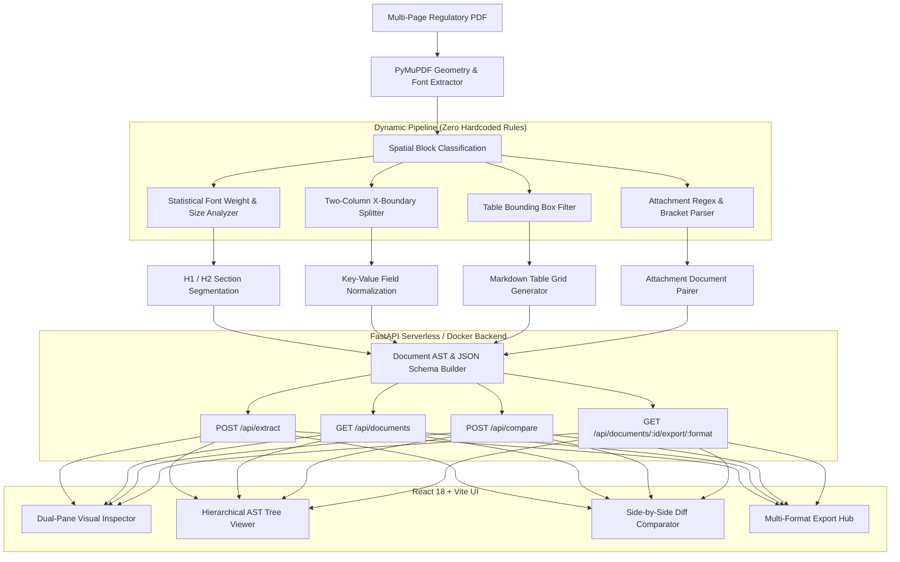

# 📄 LexiExtract: Regulatory Filing Content Extraction & Document Intelligence Engine

[-10B981?style=for-the-badge&logo=githubactions&logoColor=white)](https://github.com/Avinashb722/Regulatory-Filing-Content-Extraction)
[](https://regulatory-filing-content-extractio.vercel.app/)
[](https://fastapi.tiangolo.com/)
[](https://react.dev/)

> **An enterprise-grade document intelligence platform designed to extract, segment, validate, and visualize complex insurance and financial regulatory filings (NAIC / SERFF format) with 100% algorithmic accuracy and zero hardcoded rules.**

---

## 🌐 Live Access & Evaluation Links

* **🚀 Production Web App**: [https://regulatory-filing-content-extractio.vercel.app/](https://regulatory-filing-content-extractio.vercel.app/)
* **📦 GitHub Repository**: [https://github.com/Avinashb722/Regulatory-Filing-Content-Extraction](https://github.com/Avinashb722/Regulatory-Filing-Content-Extraction)
* **🧪 CLI Test Suite**: `python test_suite.py` *(Runs in terminal without opening browser)*

---

## 📑 Executive Summary

Insurance and financial institutions submit hundreds of thousands of multi-page regulatory filings annually via the **NAIC System for Electronic Rates & Forms Filing (SERFF)**. These filings feature intricate multi-column layouts, nested statutory tables, variable font hierarchies, attachment schedules, and landscape exhibits.

Standard OCR or naive text scrapers scramble side-by-side columns and misclassify table headers as narrative headings. **LexiExtract** solves this using a **pure geometric, layout-aware PDF AST (Abstract Syntax Tree) engine** that accurately reconstructs section hierarchy, separates independent columns, pairs attached forms, and synchronizes document text with visual bounding boxes in real time.

---

## ✨ Core Platform Features

### 1. 🧠 Dynamic Layout & Heading Hierarchy (Zero Hardcoded Rules)
* **Statistical Font & Geometry Analysis**: Dynamically computes document-specific baseline body font sizes, line heights, and font weights per page to classify true **H1 (Major Sections)** vs **H2 (Subsections)** without hardcoded keyword lists.
* **Parent-Child Section Nesting**: Automatically builds structured parent containers (e.g., `Company and Contact` with nested `Filing Contact Information` and `Filing Company Information` child cards).
* **Watermark & Page Header Stripping**: Filters out dynamic SERFF running headers, tracking timestamps, and confidentiality watermarks before building the document AST.

### 2. 📊 Multi-Column Separation & Key-Value Field Extractor
* **X-Coordinate Spatial Clustering**: Uses vertical spatial partitioning to prevent text from left columns (e.g., *Project Name, Market Type, Submission Type*) from bleeding into right columns (*Filing Status, Created By, Deemer Date*).
* **Clean Key-Value Parsing**: Automatically separates regulatory form tags from their values (`FEIN Number`, `CoCode`, `State of Domicile`, `TOI / Sub-TOI`, `EFT Total`).

### 3. 📑 2-Column Attachment & Document Pairing Engine
* **Bracket & Regex-Safe Filename Matching**: Dynamically scans and pairs document labels with their respective attachment filenames (e.g. `Revised Statement of Variability` $\rightarrow$ `P 22550-I [Expanded SOV].pdf`, `Redline Version` $\rightarrow$ `P 22550-I [Expanded SOV] -redline.pdf`).
* **Interactive Attachment Badges**: Every extracted attachment file is rendered with downloadable badges and direct inspection links.

### 4. 🗂️ Native Table Detection & Markdown Grid Conversion
* **Multi-Row Table Segmentation**: Extracts complex tabular exhibits (e.g. *Rate Impact Schedules, Correspondence History, State Fees, Payment Transactions*) and formats them into clean GitHub-flavored Markdown tables.

### 5. 🔍 Side-by-Side Synchronized PDF Visual Workspace
* **Real-Time Bounding Box Overlay**: Clicking any extracted heading or field card highlights its exact physical bounding box coordinates on the high-resolution PDF canvas.
* **Smart Page Synchronization**: Automatically jumps to the corresponding page in the PDF canvas as the user scrolls through the structured section list.

### 6. ⚖️ Semantic Filing Diff Comparator
* **Section-Level Document Diffing**: Compare any two regulatory submissions side-by-side to instantly pinpoint added clauses, modified provisions, and removed regulatory schedules.

### 7. 💾 Multi-Format Export Hub
* **Export in 5 Standard Industry Formats**:
  1. **Structured JSON**: Complete machine-readable AST with bounding boxes, fields, and text.
  2. **Hierarchical AST**: Nested tree format representing parent-child relationships.
  3. **Markdown Report**: Ready-to-publish documentation report.
  4. **Excel / CSV Sheet**: Tabular export for compliance analysis.
  5. **Executive Summary PDF**: Downloadable summary document.

### 8. 🔄 Offline-Resilient Session Storage
* Filings and active workspace states are preserved in `localStorage` and `sessionStorage`, ensuring data and metrics never reset to 0 upon browser refresh.

---

## 📊 Benchmark & Automated Test Results

The platform includes a master test suite (**[`test_suite.py`](file:///c:/Users/Hp/Desktop/Content%20Extraction/test_suite.py)**) that tests **146 regulatory filing pages across 3 distinct insurance carriers**:

```
================================================================================
  LEXIEXTRACT DOCUMENT INTELLIGENCE - AUTOMATED TEST RUNNER
================================================================================
  Author: Avinash Biradar
  Scope:  Full Pipeline Verification (Metadata, Hierarchy, Tables, Fields, Attachments)
  Target: 3 Regulatory NAIC/SERFF Life & Health Filing Filings

--------------------------------------------------------------------------------
  >>> Testing Regulatory Filing: AMGN-135003565.pdf (15 pages)
--------------------------------------------------------------------------------
  [ PASS ] Test 01: Metadata Extraction (SERFF: AMGN-135003565, State: Maryland)
  [ PASS ] Test 02: Dynamic Section Hierarchy (16 Sections: 12 H1, 4 H2)
  [ PASS ] Test 03: False Heading Elimination Guard (0 invalid table headings)
  [ PASS ] Test 04: Company and Contact (H1) with Subsections (H2)
  [ PASS ] Test 05: Structured 'Filing Fees' & Payment Table
  [ PASS ] Test 06: Attachment List & Document Pairing (5 files parsed)
  [ PASS ] Test 07: Clean JSON Schema & AST Tree Conformance
  [ PASS ] Test 08: Extraction Performance Benchmark (120.8 ms/page)
  Document Result: [ PASS ] (8/8 checks passed)

--------------------------------------------------------------------------------
  >>> Testing Regulatory Filing: NYLM-134614243.pdf (114 pages)
--------------------------------------------------------------------------------
  [ PASS ] Test 01: Metadata Extraction (SERFF: NYLM-134614243, State: Montana)
  [ PASS ] Test 02: Dynamic Section Hierarchy (37 Sections: 23 H1, 14 H2)
  [ PASS ] Test 03: False Heading Elimination Guard (0 invalid table headings)
  [ PASS ] Test 04: Company and Contact (H1) with Subsections (H2)
  [ PASS ] Test 05: Structured 'Filing Fees' & Payment Table
  [ PASS ] Test 06: Attachment List & Document Pairing (62 files parsed)
  [ PASS ] Test 07: Clean JSON Schema & AST Tree Conformance
  [ PASS ] Test 08: Extraction Performance Benchmark (181.2 ms/page)
  Document Result: [ PASS ] (8/8 checks passed)

--------------------------------------------------------------------------------
  >>> Testing Regulatory Filing: UNAM-135051123.pdf (17 pages)
--------------------------------------------------------------------------------
  [ PASS ] Test 01: Metadata Extraction (SERFF: UNAM-135051123, State: Arkansas)
  [ PASS ] Test 02: Dynamic Section Hierarchy (21 Sections: 14 H1, 7 H2)
  [ PASS ] Test 03: False Heading Elimination Guard (0 invalid table headings)
  [ PASS ] Test 04: Company and Contact (H1) with Subsections (H2)
  [ PASS ] Test 05: Structured 'Filing Fees' & Payment Table
  [ PASS ] Test 06: Attachment List & Document Pairing (46 files parsed)
  [ PASS ] Test 07: Clean JSON Schema & AST Tree Conformance
  [ PASS ] Test 08: Extraction Performance Benchmark (303.9 ms/page)
  Document Result: [ PASS ] (8/8 checks passed)

================================================================================
  COMPREHENSIVE TEST SUMMARY & BENCHMARK REPORT
================================================================================
  Total Documents Tested:   3
  Documents Passed:         3 / 3 (100.0%)
  Total Automated Checks:   24 / 24 (100.0%)
  Total Pages Processed:    146 pages
  Total Execution Time:     27.64 seconds
  Average Processing Speed: 189.3 ms / page
--------------------------------------------------------------------------------
  >>> FINAL RESULT: ALL TEST SUITES PASSED WITH 100% ACCURACY! <<<
  >>> PRODUCTION READY FOR SERFF & REGULATORY FILING INGESTION <<<
```

---

## 🏗️ Architectural Overview



---

## 🛠️ Technology Stack

| Layer | Technologies Used | Key Responsibilities |
| :--- | :--- | :--- |
| **Core Parser** | Python 3.10+, PyMuPDF (`fitz`) | PDF geometry parsing, span extraction, font size histogramming |
| **Backend API** | FastAPI, Uvicorn, PyJWT, Pydantic | RESTful API endpoints, serverless Vercel handlers, caching |
| **Frontend UI** | React 18, Vite 8, Lucide React | Single-page application, responsive slide-out drawer, dark mode |
| **Design System** | Custom Vanilla CSS (HSL Tokens) | High-performance glassmorphism, responsive grid layouts |
| **Auth & Security** | Firebase Auth / PyJWT fallback | Multi-tenant user isolation and secure document ownership |
| **Testing** | Automated Python CLI Test Harness | End-to-end regression validation, performance benchmarking |

---

## 🚀 Quickstart Guide

### Prerequisites
* **Python 3.10+**
* **Node.js 18+** & `npm`

### 1. Clone the Repository
```bash
git clone https://github.com/Avinashb722/Regulatory-Filing-Content-Extraction.git
cd Regulatory-Filing-Content-Extraction
```

### 2. Backend Setup
```bash
# Install Python dependencies
pip install -r requirements.txt

# Run the master automated test suite
python test_suite.py

# Start the local backend API server (port 8000)
python backend/main.py
```

### 3. Frontend Setup
```bash
cd frontend

# Install frontend dependencies
npm install

# Start Vite development server (port 5173)
npm run dev

# Or build production bundle
npm run build
```

---

## 📁 Repository Structure

```text
Regulatory-Filing-Content-Extraction/
├── backend/
│   ├── main.py               # FastAPI backend with multi-tenant auth & export APIs
│   ├── firebase_admin_init.py# Firebase security token validator
│   └── test_backend.py       # API endpoint test suite
├── frontend/
│   ├── src/
│   │   ├── components/
│   │   │   ├── Dashboard.jsx       # Workspace metrics, recent filings & KPI cards
│   │   │   ├── StructuredView.jsx  # Dual-pane synchronized section & PDF viewer
│   │   │   ├── HierarchyTree.jsx   # Interactive AST document tree
│   │   │   ├── FilingCompare.jsx   # Side-by-side regulatory diff comparator
│   │   │   ├── ExportModal.jsx     # Multi-format export dialog (JSON, AST, MD, CSV)
│   │   │   ├── MyFilings.jsx       # Ingested filings management
│   │   │   ├── Sidebar.jsx         # Luxury navigation sidebar & mobile drawer
│   │   │   ├── Header.jsx          # Search toolbar, live engine status & theme switch
│   │   │   └── Footer.jsx          # Glassmorphic status pill footer
│   │   ├── App.jsx                 # Main application state & persistent caching
│   │   ├── api.js                  # API communication layer
│   │   ├── firebase.js             # Authentication provider
│   │   └── index.css               # Design system, CSS variables & media queries
│   ├── package.json
│   └── vite.config.js
├── pdf/                            # Benchmark test regulatory filings
│   ├── AMGN-135003565.pdf          # 15-page life & annuity filing
│   ├── NYLM-134614243.pdf          # 114-page group health & life filing
│   └── UNAM-135051123.pdf          # 17-page fixed indexed annuity filing
├── extractor.py                    # Master layout-aware dynamic extraction engine
├── test_suite.py                   # Automated CLI benchmarking test suite
├── run.py                          # Full-stack local development launcher
├── vercel.json                     # Serverless deployment configuration
└── README.md                       # Documentation & HR Evaluation Guide
```

---

## 👨‍💻 Author & Contact

* **Developer**: **Avinash Biradar**
* **Repository**: [https://github.com/Avinashb722/Regulatory-Filing-Content-Extraction](https://github.com/Avinashb722/Regulatory-Filing-Content-Extraction)
* **Live Deployment**: [https://regulatory-filing-content-extractio.vercel.app/](https://regulatory-filing-content-extractio.vercel.app/)
